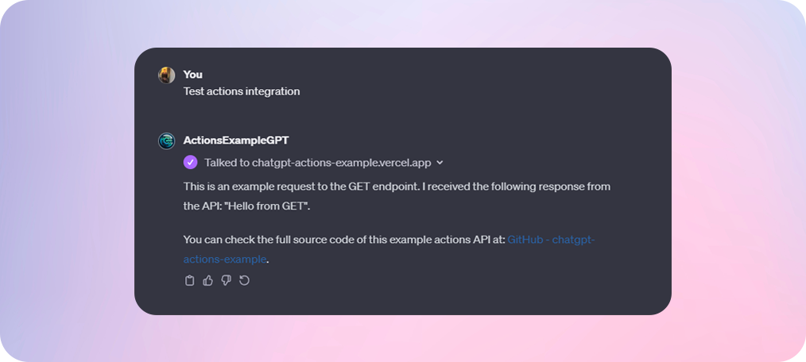

# ChatGPT actions example API

Minimal template repository for making your own REST APIs for chatgpt plugins or actions. Inspiration from [Fireship's video](https://www.youtube.com/watch?v=9T_wv6D8PYo).

    

## Backstory:
ChatGPT has recently introduced actions and plugins, enhancing its capabilities through third-party APIs. This feature enables you to send user prompts to your server, analyze them, and use the insights as context for ChatGPT responses. It also allows for extracting specific segments from user prompts to dynamically format API calls to your backend server. This integration is particularly useful for combining data from external APIs with GPT responses, enriching the overall user experience.

Furthermore, OpenAI is set to launch the ChatGPT Store, a platform where individuals can sell custom GPT assistants. Leveraging third-party APIs in conjunction with GPT can provide significant value, potentially leading to substantial earnings.

This repository offers a basic template to help you start creating your own APIs. It can be directly hosted on Vercel, which is free of charge :) Simply click the deploy button, and you're all set!

## Development setup:

1) Install [vercel cli](https://vercel.com/docs/cli). `npm i -g vercel`.

2) Run local development server:
`vercel dev`

3) Deploy to vercel:
`vercel deploy`

## Example GPT integration images:

### Test example integration:
Click [here](https://chat.openai.com/g/g-h6MedbsaF-actionsexamplegpt) to test example GPT!

